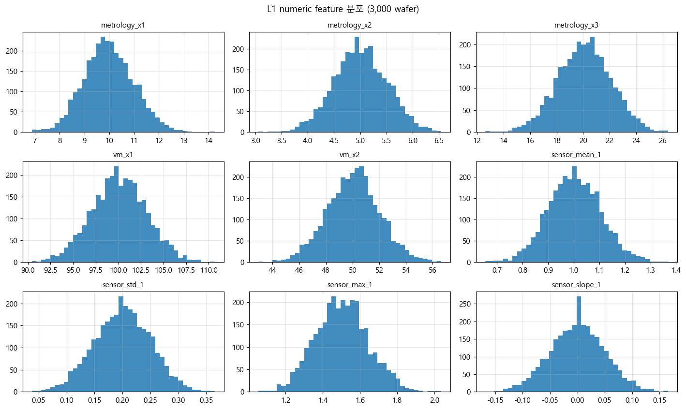
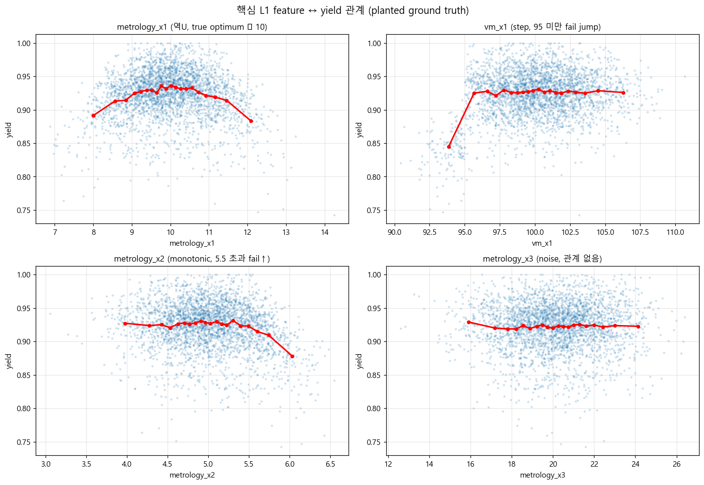
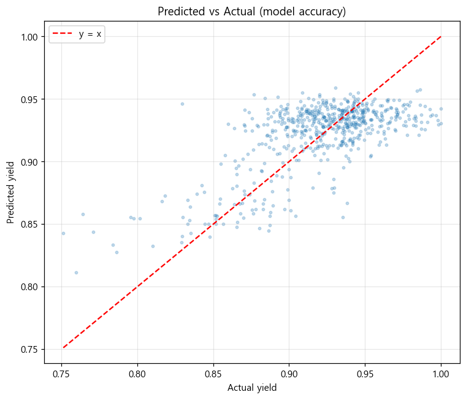
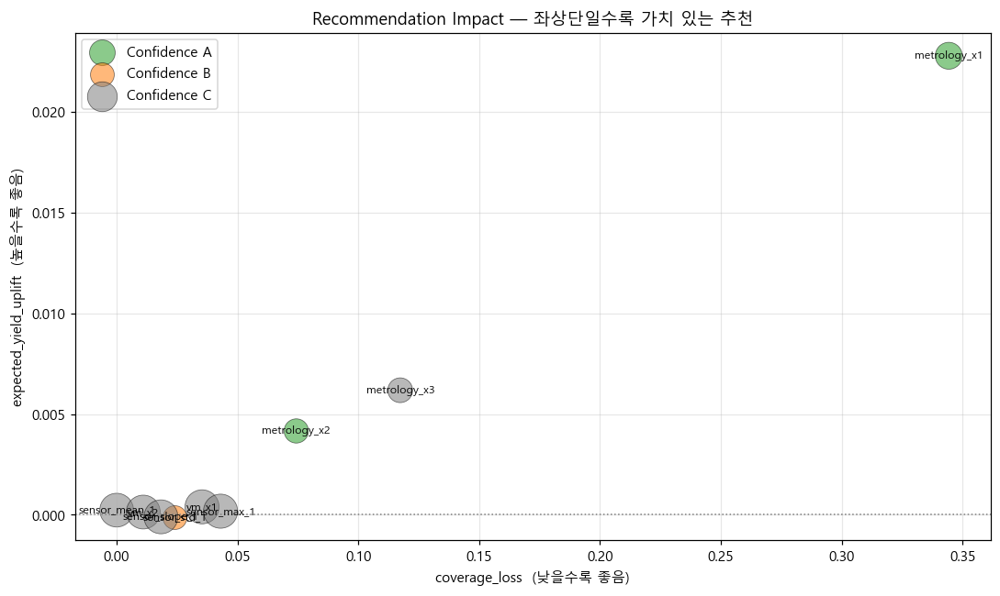
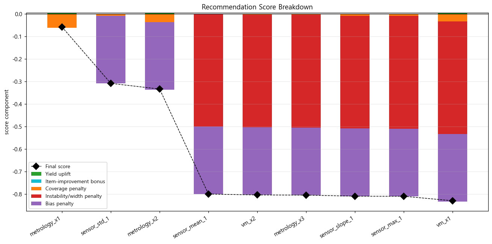
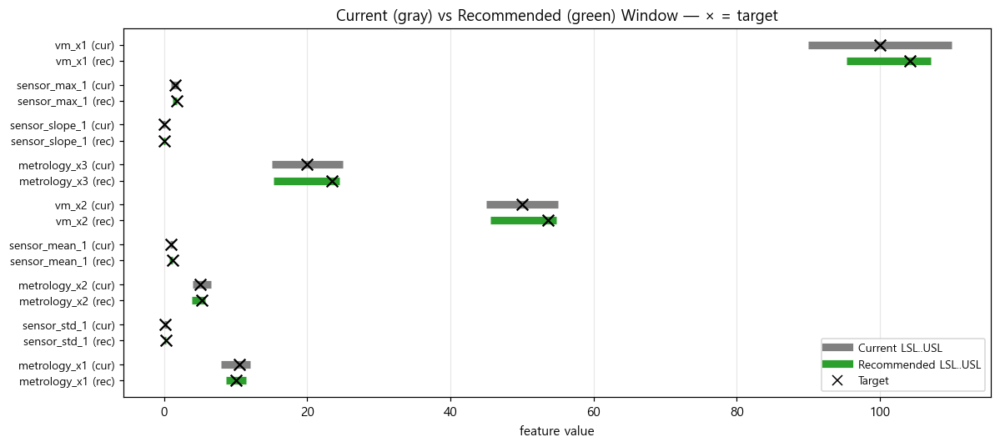

# Process Window Prototype

L1 데이터 (계측값 / Virtual Metrology / 설비 Sensor 요약값) 로부터 L3 데이터 (EDS item 불량률, total fail rate, yield) 를 예측하고, 현재 L1 Trend 의 Target/LSL/USL 이 **수율 관점에서 적절한지** 판단하는 프로토타입.

7월까지 확보할 baseline 모델, 8~9월 로직 최적화의 출발점.

---

## 두 가지 모드

### Optimization Mode
- 현재 L1 관리 SPEC 과 Target 이 수율 최적인지 검증
- Target shift, LSL/USL 조정 후보 제시
- 추천 Window 안/밖 의 예상 yield, fail rate, coverage 손실 계산
- 추천 근거 (`reason_summary`) 와 신뢰도 등급 (A/B/C) 제공

### Exploration Mode
- L1 변수와 L3 결과 간 관계 시각화
- 특정 threshold 이후 fail rate 증가 구간 탐지
- Product / Tool / Chamber 별 segment 분석
- L3 item 별 영향도

---

## L1 / L3 정의

| 종류 | 컬럼 예시 | 설명 |
|---|---|---|
| L1 - ID | wafer_id, lot_id, event_time | 행 단위 식별 |
| L1 - context | product, process_step, tool_id, chamber_id, recipe_id | 설비/제품 메타 |
| L1 - metrology | metrology_x1..3 | 계측 값 |
| L1 - VM | vm_x1, vm_x2 | Virtual Metrology |
| L1 - sensor | sensor_mean_1, sensor_std_1, sensor_max_1, sensor_slope_1 | 설비 sensor 요약 |
| L3 - per item | eds_item_001~003_fail_rate | EDS item 별 불량률 |
| L3 - total | total_fail_rate, yield | 합산 fail rate / yield (= 1 - total_fail_rate) |

L3 컬럼은 **prediction target** 이며 모델 feature 로 사용 금지 (`src/data_loader.py` docstring 참조).

---

## 설치

```bash
pip install -r requirements.txt
```

`xgboost` / `lightgbm` / `shap` 은 필수 의존성이 아닙니다. 설치되어 있으면 `feature_importance(method="shap")` 처럼 옵션으로 사용 가능.

---

## 미리 포함된 가상 데이터 + 결과물

다음 파일이 **이미 repo 에 포함**되어 있어 clone 직후 시각화/결과를 바로 확인 가능:

| 파일 | 설명 |
|---|---|
| [data/sample_l1.csv](data/sample_l1.csv) | 3,000 wafer 가상 L1 (계측/VM/sensor) |
| [data/sample_l3.csv](data/sample_l3.csv) | 3,000 wafer 가상 L3 (eds_item fail rate, total_fail_rate, yield) |
| [data/current_specs.csv](data/current_specs.csv) | 9개 L1 feature 의 현재 LSL/Target/USL (일부 의도적 suboptimal) |
| [outputs/evaluation_report.html](outputs/evaluation_report.html) | **데이터 개요 + 모델 + 추천 품질** 시각화 통합 인터랙티브 리포트 (브라우저로 열기) |
| [outputs/recommendations.csv](outputs/recommendations.csv) | 9개 feature 추천 결과 |
| [outputs/model_metrics.csv](outputs/model_metrics.csv) | MAE / RMSE / R² |

→ 새 데이터 생성: `python -m src.app --cli --generate-sample` (같은 seed=42 로 deterministic 재현)

---

## 시각화 예시 (GitHub 페이지에서 바로 확인)

가상 데이터 3,000 wafer 로 학습/추천한 결과 (스크립트 `python -m src.export_readme_images` 로 재생성).

### 1) 입력 데이터 — L1 feature 분포

3,000 wafer 의 9개 L1 numeric feature 분포. 각 feature 의 평균/스케일/노이즈 수준 확인용.



### 2) Ground truth — 네 가지 window 모양 (feature ↔ fail rate)

현장 직관에 맞춰 y축은 **total_fail_rate**. 회색 점선 = 현재 LSL/USL, 검은 실선 = 현재 target.
data 에 의도적으로 심어둔 네 가지 전형적 window 모양:



| 모양 | 예시 feature | 데이터 특성 | 정답 SPEC 추천 |
|---|---|---|---|
| **양쪽 들림 (U)** | metrology_x1, vm_x1 | optimum 중심에서 멀어질수록 fail↑ | target 유지, window 양쪽 좁힘 |
| **오른쪽 들림** | metrology_x2, sensor_std_1 | 특정 임계 초과 시 fail↑ | USL 좁힘 |
| **왼쪽 들림** | metrology_x3 | 특정 임계 미만 시 fail↑ | LSL 끌어올림 |
| **flat (noise)** | vm_x2, sensor_max_1, sensor_slope_1 | 관계 없음 | 추천 없음 / Confidence C |

(이 모양은 fab 에서 흔히 관찰되는 4가지 trend 패턴을 그대로 모사한 것)

### 3) 모델 정확도 — Predicted vs Actual

`HistGradientBoostingRegressor` 학습 결과 (random split, **R² ≈ 0.81**).
점이 빨간 대각선 주변에 모일수록 정확. ground-truth 관계가 분명하기 때문에 model 이 큰 패턴을 잘 잡아낸다.



### 4) 추천 품질 — Impact (uplift × coverage loss)

각 feature 추천의 **좌상단** (낮은 coverage loss + 높은 yield uplift) 일수록 가치 있음.
색 = Confidence (A=초록 / B=주황 / C=회색), 크기 = |score|.



- **metrology_x1** (양쪽 들림): yield uplift **+2.3%p** — 양쪽 좁히는 추천이 가장 큰 효과. Confidence A.
- **metrology_x3** (왼쪽 들림): uplift +0.6%p — LSL 끌어올리기 추천.
- **metrology_x2** (오른쪽 들림): uplift +0.4%p, **Confidence A** — USL 좁힘.
- **하단 무리**: flat/약한 효과 feature 들 (vm_x2, sensor_max_1 등) → 추천 점수 ≈ 0, Confidence C. 의도된 결과.

### 5) Score Breakdown

각 추천의 final score 가 어떤 구성요소 (uplift / bonus − coverage/instability/bias penalty) 의 합으로 나왔는지.
검은 다이아몬드 = 최종 점수.



대부분 feature 가 `instability penalty + bias penalty` 로 점수가 깎이는 게 보임 → 추천 신뢰도가 전반적으로 낮음 → R² 개선 또는 segment 별 모델 필요 (다음 단계).

### 6) Current vs Recommended Window — 모양별 추천이 다르게 나옴

feature 별로 현재 (회색) 와 추천 (초록) [LSL .. USL] 범위 + target (×).
**이동 방향 / 좁힘 / 넓힘이 ground-truth 모양에 맞게 다르게 나오는지** 가 핵심 검증 지점.



| Feature | 모양 | 현재 [LSL..USL] | 추천 [LSL..USL] | 검증 |
|---|---|---|---|---|
| metrology_x1 | 양쪽 들림 | [8, 12] | ~[9, 11] | 양쪽 좁힘 ✓ |
| vm_x1 | 양쪽 들림 (asymmetric) | [90, 110] | ~[95, 107] | 양쪽 좁힘 ✓ |
| metrology_x2 | 오른쪽 들림 | [4, 6.5] | ~[4, 5.7] | USL 좁힘 ✓ |
| metrology_x3 | 왼쪽 들림 | [15, 25] | ~[18, 24] | LSL 끌어올림 ✓ |
| vm_x2, sensor_max_1 | flat | (변동 없음) | (거의 동일) | 추천 무의미 ✓ |

### → 인터랙티브 버전

위 차트는 정적 PNG. **줌/툴팁/필터** 가 필요하면:
- [`outputs/evaluation_report.html`](outputs/evaluation_report.html) 을 브라우저로 열기
- 또는 `streamlit run streamlit_app.py` → http://localhost:8501

---

## 실행

### Streamlit UI

```bash
streamlit run streamlit_app.py
```

> ℹ️ `streamlit_app.py` 는 루트의 thin wrapper. `streamlit run src/app.py` 는
> Python 의 패키지 import 규칙 때문에 `ImportError: attempted relative import`
> 가 나므로 이 wrapper 를 거쳐 실행한다.

화면 구성:
1. Data — sample 생성 / `data/` 로드
2. Train — 모델 학습 + feature importance
3. Optimization — SPEC 추천 테이블 / 상세 plot / CSV download
4. Exploration — feature ↔ L3 관계 + segment 분석
5. Evaluation — 모델 정확도 + 추천 품질 시각화 + HTML 리포트 export
6. Help

### CLI (Streamlit 미사용)

```bash
# 데이터 생성 → 학습 → 추천 → 평가 HTML 리포트 한 번에
python -m src.app --cli --generate-sample --train --recommend --report --top-n 10
```

옵션:
- `--target {yield, total_fail_rate}` (기본 `yield`)
- `--split {random, time}` (기본 `random`. `time` = event_time 상위 20% test)
- `--model {hgb, rf}` (기본 HistGradientBoostingRegressor)
- `--report` — `outputs/evaluation_report.html` 생성 (자동으로 train+recommend 포함)
- `--n-wafers N` (sample 생성 시 wafer 수)
- `--min-coverage 0.6` (추천 window 최소 coverage)
- `--seed 42`

산출:
- `outputs/model_metrics.csv` — MAE/RMSE/R²
- `outputs/recommendations.csv` — 전체 추천 결과
- `outputs/evaluation_report.html` — 모델 정확도 + 추천 품질 시각화 통합 리포트

---

## Sample Data 생성 방식

`src/data_generator.py` 가 fab 에서 흔히 보는 **네 가지 window 모양** (fail-rate 관점) 을 모두
포함한 synthetic data 를 만든다. 각 feature 의 fail-rate 곡선이 다음 모양 중 하나:

| 모양 | Feature | 데이터 룰 |
|---|---|---|
| **양쪽 들림 (U)** | `metrology_x1` | `fail += 0.04 · ((x - 10)/1)²` (optimum 10) |
| **양쪽 들림 (asymmetric)** | `vm_x1` | left arm `0.006·(95-x)^1.5`, right arm `0.003·(x-107)^1.2` |
| **오른쪽 들림** | `metrology_x2` | `fail += 0.10 · max(0, x - 5.5)` |
| **오른쪽 들림 (mild)** | `sensor_std_1` | `fail += 0.20 · max(0, x - 0.22)` |
| **오른쪽 들림 + 교호작용** | `sensor_mean_1` | `TOOL_A`에서만 `0.06 · max(0, x-1.0)` — segment bias 데모 |
| **왼쪽 들림** | `metrology_x3` | `fail += 0.05 · max(0, 18 - x)` |
| **flat (noise)** | `vm_x2`, `sensor_max_1`, `sensor_slope_1` | 효과 없음 (음성 대조군) |

`current_specs.csv` 는 의도적으로 suboptimal: 양쪽 들림은 window 가 너무 넓고, 오른쪽 들림은
USL 이 fail 영역까지 허용, 왼쪽 들림은 LSL 이 fail 영역까지 허용. 추천이 이를 올바른 방향으로
조정하는지가 검증 기준.

---

## Baseline Model

기본 모델: `HistGradientBoostingRegressor` (sklearn).
- NaN 직접 처리 가능
- one-hot 인코딩 한 categorical + numeric pass-through 를 `ColumnTransformer` 로 결합한 Pipeline

대체: `--model rf` 로 `RandomForestRegressor` 사용.

평가:
- MAE / RMSE / R² (holdout test set)
- Split: random 또는 time (out-of-time)

---

## Window Recommendation 산출 방식 (`src/window_optimizer.py`)

각 `adjustable_flag=1` 인 feature `f` 에 대해:

1. **Current window stats** — `[LSL, USL]` 안에서의 평균 yield 와 coverage 계산.
2. **Response curve** — 모델 PDP-style sweep (다른 feature 는 median/mode 고정) 으로 `yield(v)` 곡선 + 실측 binned 곡선 (sanity check) 동시 생성.
3. **Target 후보** = response curve argmax.
4. **LSL/USL 후보** = target 주변에서 모델 yield 가 `peak - margin` 이상인 가장 넓은 contiguous range. `min_coverage` 미달이면 양쪽으로 확장.
5. **Score**:
   ```
   recommendation_score = expected_yield_uplift
                        - 0.5 * coverage_loss
                        - instability_penalty   (모델 vs 실측 target 큰 차이 / window 너무 좁음)
                        - bias_penalty          (tool/product 별 추천 방향 반대)
                        + major_item_improvement_bonus  (특정 EDS item fail 0.5pp+ 개선)
   ```
6. **Confidence A/B/C** — model R² + 모델/실측 target 일치도.
7. **Reason summary** — 한 줄 자연어 (현재 vs 추천 target, yield 변화, coverage 변화, bias, item 기여, confidence).

---

## 성능 평가 기준 및 시각화

이 프로토타입의 목적은 **"모델 정확도"가 아니라 "SPEC 추천 품질"** 평가이다.
R² 가 낮아도 추천이 ground-truth 방향과 맞는지가 더 중요하다.
이를 위해 평가를 **두 축**으로 나눠 본다.

### 1) 모델 정확도 (`outputs/model_metrics.csv` + 차트)

| 지표 | 설명 | 판정 |
|---|---|---|
| **MAE** | 평균 절대 오차 | 작을수록 좋음 |
| **RMSE** | 큰 오차에 가중치 | 작을수록 좋음 |
| **R²** | 분산 설명력 (1.0 이상적) | 0.3 이상이면 추천 신뢰도 B 이상 가능 |

해당하는 시각화:
- **Predicted vs Actual scatter** — 빨간 대각선 (y=x) 에 점이 모일수록 정확.
- **Residual plot** — 잔차가 0 주변에서 무작위면 unbiased.
  특정 예측 구간에서 변동성이 커지면 모델 보완 필요.
- **Permutation Feature Importance bar** — 해당 feature 셔플 시 R² 가 얼마나 떨어지는지.
  추천 결과 해석의 1차 근거.

### 2) 추천 품질 (`outputs/recommendations.csv` + 차트)

| 지표 | 설명 |
|---|---|
| `current_window_yield` vs `recommended_window_yield` | 추천 효과 (실측 기반) |
| `coverage_loss` | 추천이 얼마나 wafer 를 spec 밖으로 밀어내는가 |
| `confidence_grade` (A/B/C) | 모델 R² + 모델/실측 target 일치도 기반 |
| `recommendation_score` | uplift − penalties + bonus, 정렬 기준 |
| `reason_summary` | 한 줄 자연어 (엔지니어 검토용) |

해당하는 시각화:
- **Recommendation Impact (bubble)** — x = coverage_loss, y = expected_yield_uplift,
  size = |score|, color = confidence. **좌상단 (낮은 coverage loss + 높은 uplift)** 일수록
  가치 있는 추천. 우상단에 있으면 "수율은 오르지만 wafer 많이 버린다" → 검토 필요.
- **Score Breakdown (stacked bar + line)** — final score 가 어떤 구성요소
  (uplift, coverage penalty, instability/width penalty, bias penalty, item bonus) 의
  합으로 나왔는지. 검은 다이아몬드 = 최종 점수. 어떤 추천이 어디서 깎이는지 직관적.
- **Current vs Recommended Window** — feature 별 현재 (회색) vs 추천 (초록)
  [LSL .. USL] 범위. × = target. 이동 방향, 좁힘/넓힘이 한눈에 보임.
- **Confidence Distribution** — A/B/C 비율. C 가 많으면 모델 자체 개선 우선.

### 3) HTML 리포트 한 번에 보기

[`outputs/evaluation_report.html`](outputs/evaluation_report.html) 을 브라우저로 열면
다음 순서로 흐름을 따라갈 수 있다 (가상 데이터 기준 사전 생성 포함):

```
0. 데이터 개요              ← 가상 데이터 분포 + L1↔L3 ground-truth 관계
   0-1. mart 처음 8행
   0-2. L1 numeric 분포
   0-3. L3 yield/fail 분포
   0-4. 핵심 feature ↔ yield 관계 (역U, step, monotonic, noise)
   0-5. tool/product 별 yield boxplot
1. 모델 정확도              ← 데이터 → 모델이 얼마나 잘 잡았나
   metrics 표 + predicted-vs-actual + residual + feature importance
2. 추천 품질                ← 모델 → 추천이 얼마나 가치 있나
   impact bubble + score breakdown + window 비교 + confidence 분포
3. Top recommendations      ← 엔지니어 검토용 reason 포함
```

재생성:

```bash
python -m src.app --cli --generate-sample --train --recommend --report
```

또는 Streamlit **Evaluation** 탭에서 동일한 차트 + HTML 다운로드 버튼 제공.

### 4) Ground-truth 대조 (synthetic data 한정)

`src/data_generator.py` 는 4가지 window 모양 (양쪽/왼쪽/오른쪽/flat) 을 모두 심어두므로,
추천이 모양에 맞게 적절히 다르게 나오는지 즉시 검증 가능:

| Feature | 모양 | 정답 추천 방향 | 실측 |
|---|---|---|---|
| `metrology_x1` | 양쪽 들림 (U) | 양쪽 좁힘, target 10 유지 | LSL 8→9, USL 12→11 ✓ Confidence A |
| `vm_x1` | 양쪽 들림 (asymmetric) | 양쪽 좁힘 | LSL 90→95, USL 110→107 ✓ |
| `metrology_x2` | 오른쪽 들림 | USL 좁힘 | USL 6.5→5.7 ✓ Confidence A |
| `metrology_x3` | 왼쪽 들림 | LSL 끌어올림 | LSL 15→18.7 ✓ |
| `vm_x2`, `sensor_max_1` | flat | 추천 없음 / Confidence C | 변화 거의 없음 ✓ |

실제 fab 데이터에는 ground-truth 가 없으므로 위 1) + 2) 의 정량 + 정성 지표와
**도메인 엔지니어 검토** 가 평가의 핵심이 된다.

---

## ⚠ 주의사항

- 본 도구의 추천은 **통계적 상관관계** 기반이다. **인과관계가 아님.**
- 실제 SPEC 변경 전 반드시 다음을 거쳐야 한다:
  1. 공정 엔지니어 도메인 리뷰
  2. Pilot lot 검증
  3. 변경 후 trend 모니터링
- Synthetic 데이터로 검증된 동작이 실제 fab 데이터에서 동일하리라는 보장은 없다.
- `metrology_x3` 처럼 신호가 없는 feature 도 강제 추천이 나올 수 있으므로 `confidence_grade=C` 인 추천은 reference 로만 사용.

---

## 다음 단계 (8~9월 이후 후보)

- 다변량 동시 window 최적화 (현재는 univariate)
- 실제 fab 데이터 연결 (DB / parquet)
- Per-item 모델로 EDS item 별 영향도 정량화
- Drift 모니터링 / 모델 재학습 자동화
- Counterfactual / Causal 추론 도입 (Causal Forest 등)
- A/B test framework, pilot lot 결과 자동 수집
- 권한 / 인증 (multi-user 환경)
